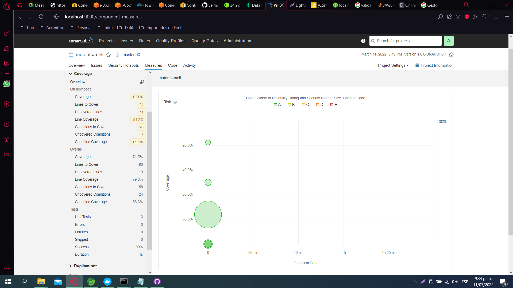

# Prueba Mutants MeLi
## _Descripcion_
El reto consiste en crear unA API la cual debe poder detectar si el adn de una persona es Mutante. Para esto se debe validar el input que corresponde a una matriz de NxN y si se encuentra dos o mas secuencias de ADN mayores al valor dado ( 4 en este caso ) se cataloga como mutante. Tambien se debe poder consultar la cantidad de humanos y mutantes q se han enviado y el ratio entre estos.

## _Implementacion_

- Java 11
- Maven 3.8.4
- MongoDB
- Junit
- Desplegado en una instancia EC2 de AWS

## _Ejecucion_

Para iniciar los servicios se debe ejecutar lo siguiente en el mismo orden:
```sh
java -jar mutants-meli-persistence-1.0.0-SNAPSHOT.jar
java -jar mutants-meli-1.0.0-SNAPSHOT.jar
```
Los servicios estan expuestos a través de AWS bajo los siguientes url :
Se debe realizar una petición POST a la siguiente url: [ValidarADN](http://34.224.215.221:8001/swagger-ui/index.html?configUrl=/v3/api-docs/swagger-config#/app-controller/validateMutants) 

Se debe enviar en el body la cadena de adn a verificar, por ejemplo :
```sh
{"dna":["AAATGT",
         "CAGCCC",
         "TTTTGT",
         "AGAAGG",
         "CCCCTA",
         "TCACTG"]}
```
El servivio retornará un estado 200 o 403 según el caso

## _Coverage_
<p align="center"> 
  
</p>


## _Sonar_
<p align="center"> 
  
</p>
